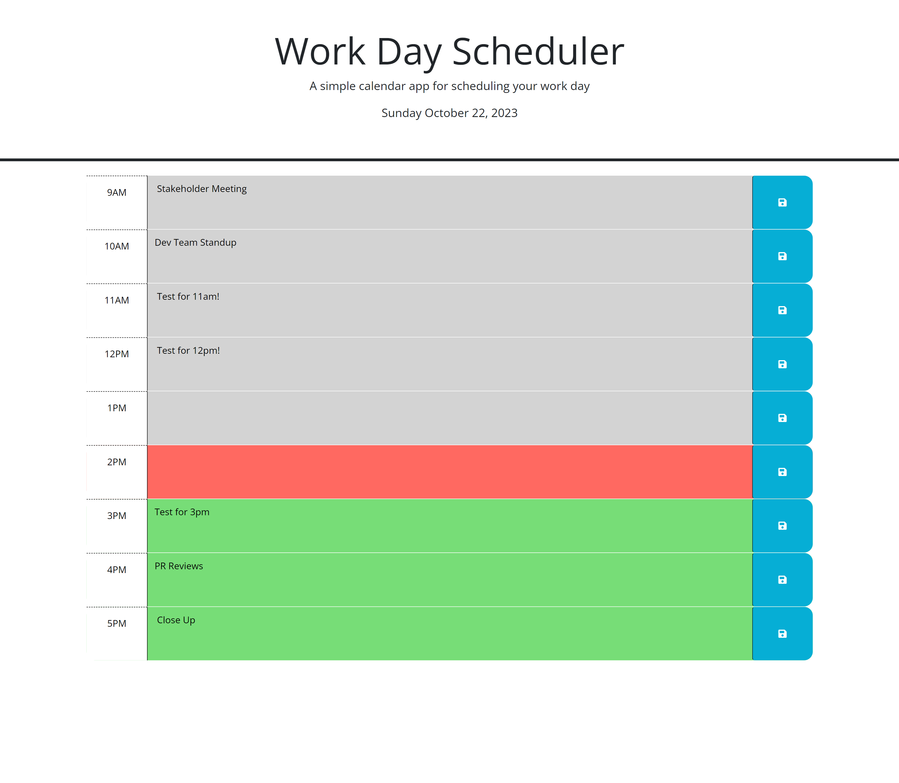

# Workday Calendar
## Description
This application allows the user to store and review their events in a given day. Between regular business hours (9am-5pm), the user can store information about events that occurs in each time block. For user convenience, time blocks are highlighted different colors relative to the current time: grey for past events, green for upcoming, and red for current events. The application can be found [here](https://aaron-heath.github.io/workday-calendar/).

The application will validate user input to ensure that it conforms to the variable types and parameters outlined in the prompts provided to the user.

See the a screenshot below:

## Installation

N/A

## Usage

Click into the appropriate textarea and type in your event. Click the blue save button to the right to save that event in local storage.

## Credits

N/A